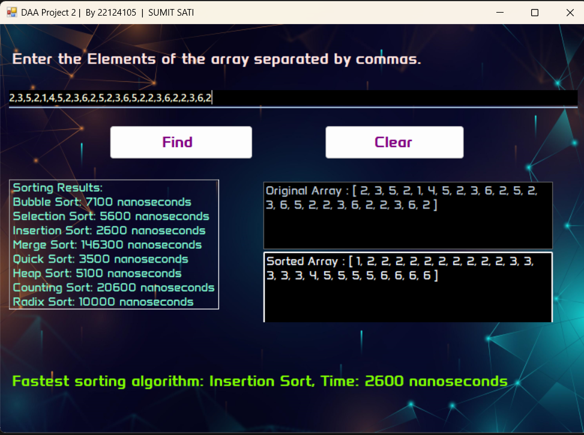

# Fastest Sorting Algorithm Finder



## Table of Contents
- [Introduction](#introduction)
- [Features](#features)
- [Installation](#installation)
- [Usage](#usage)
- [Supported Sorting Algorithms](#supported-sorting-algorithms)
- [Contributing](#contributing)
- [License](#license)
- [Contact](#contact)

## Introduction
The **Fastest Sorting Algorithm Finder** is a C++ Windows GUI application designed to identify the most efficient sorting algorithm for a given input array. By leveraging various sorting techniques, this tool benchmarks their performance and highlights the optimal choice for your specific dataset.

## Features
- **User-friendly GUI:** Easy-to-navigate interface for testing different sorting algorithms.
- **Performance Benchmarking:** Compares execution times of various sorting algorithms.
- **Real-time Results:** Displays the fastest algorithm for the given input instantly.
- **Custom Input:** Allows users to input their own arrays for testing (Only numbers for now).

## Installation
To run the **Fastest Sorting Algorithm Finder** on your Windows machine, follow these steps:

1. **Clone the repository:**
    ```bash
    git clone https://github.com/satisumit/DAAProject-Find-Fastest-Sorting-Algorithm.git
    ```

2. **Navigate to the project directory:**
    ```bash
    cd DAAProject
    ```

3. **Open the project in your preferred C++ IDE (e.g., Visual Studio).**

4. **Build the project:**
    - Ensure you have all necessary dependencies and libraries installed.
    - Build the solution to generate the executable.


## Usage
1. **Launch the Application:**
   - Run the executable generated after building the project.

2. **Input Array:**
   - Enter the array elements you wish to sort in the provided input field (Input only numbers).

3. **Start Benchmarking:**
   - Click the 'Find' button to begin the benchmarking process.

4. **View Results:**
   - The application will display the fastest sorting algorithm along with the execution time for each algorithm tested.

## Supported Sorting Algorithms
- **Bubble Sort**
- **Selection Sort**
- **Insertion Sort**
- **Merge Sort**
- **Quick Sort**
- **Heap Sort**
- **Radix Sort**
- **Counting Sort**

## Contributing
Contributions are welcome! If you'd like to improve this project, please follow these steps:

1. **Fork the repository.**
2. **Create a new branch:**
    ```bash
    git checkout -b feature/your-feature
    ```
3. **Make your changes and commit them:**
    ```bash
    git commit -m 'Add some feature'
    ```
4. **Push to the branch:**
    ```bash
    git push origin feature/your-feature
    ```
5. **Submit a pull request.**

## Contact
For any questions or feedback, please reach out to:

- **Email:** sumit.sati2508@gmail.com
- **GitHub:** [satisumit](https://github.com/satisumit)


